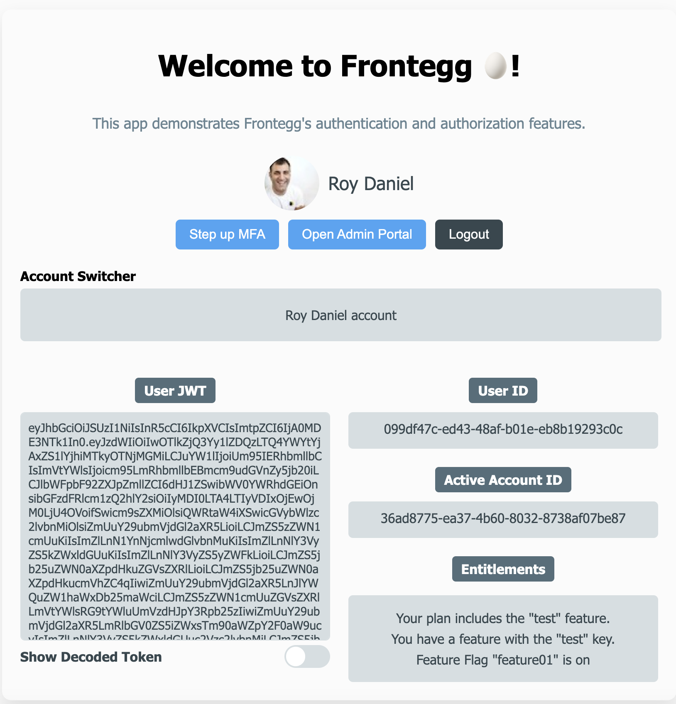

# Frontegg - Hosted Login React integration

Reference documentation - [Hosted Login Integration (React)](https://docs.frontegg.com/docs/react-hosted-login-guide).

## How to run

### Frontegg account setup
Signup for a Frontegg account on one of our public regions:
- EU ➜ https://portal.frontegg.com/signup
- US ➜ https://portal.us.frontegg.com/signup
- CA ➜ https://portal.ca.frontegg.com/signup
- AU ➜ https://portal.au.frontegg.com/signup

Come back here once you complete the initial onboarding form

### Code setup

1. Clone the repo & install the dependencies
```
git clone https://github.com/fxcircus/frontegg-react-demo.git frontegg_react_sample

cd frontegg_react_sample

npm i
```

2. Navigate to `src/index.js` in your IDE or open it from the terminal
```
code .
```

 Add your Client ID and API Key from `Frontegg Portal ➜ [ENVIRONMENT] ➜ Env Settings page`:

```
const contextOptions = {
  baseUrl: 'https://[YOUR_SUBDOMAIN].frontegg.com', // Login URL (WITHOUT /oauth) from Frontegg Portal ➜ [ENVIRONMENT] ➜ Env Settings page
  clientId: '[YOUR-CLIENT-ID]',                     // Client ID Frontegg Portal ➜ [ENVIRONMENT] ➜ Env Settings page
  appId: '[APPLICATION_ID]',   // ID from Frontegg Portal ➜ [ENVIRONMENT] ➜ Applications ➜ Your application


  tenantResolver: () => ({
    tenant: new URLSearchParams(window.location.search).get("organization"),
  }),
};
```
Save the file

### Complete the integration

Run the code from your terminal
```
npm start
```

Open your browser and navigate to `http://localhost:3000`

Signup as a new user and explore the features Frontegg provides out of the box!


